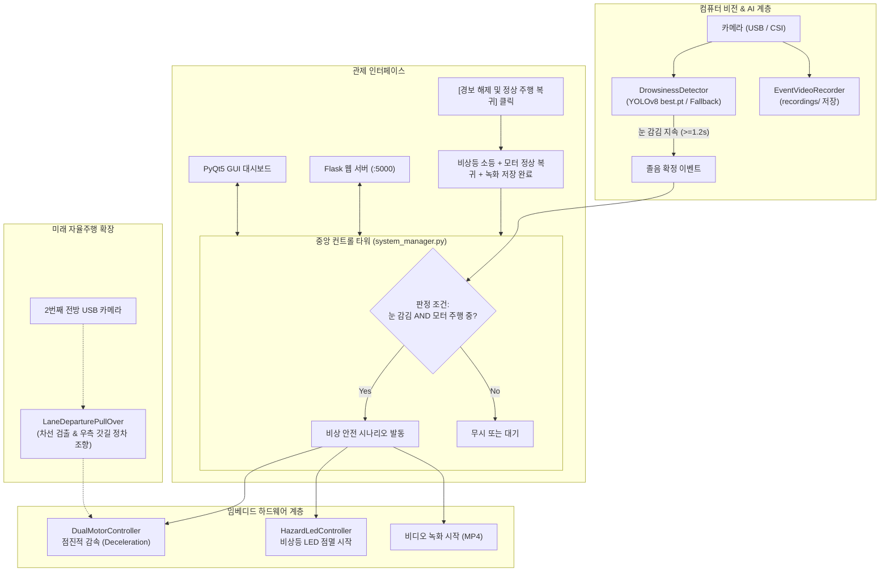

# 🚗 AI 운전자 졸음 감지 및 자율 안전 감속 로봇 관제 시스템
## [부서별 설계 내역 및 모듈별 수정 가이드북 (MODIFICATIONS.md)]

---

### 1. 부서별 역할 분담 및 프로젝트 개요

본 프로젝트는 라즈베리파이 기반 임베디드 로봇 환경에서 운전자의 졸음 상태를 AI(YOLOv8 / OpenCV Haar Cascade)로 실시간 감지하여, **"운전자의 눈 감김 상태가 감지되면 즉시 해당 순간부터 영상을 자동 녹화하고, 차량 주행 중일 경우 모터 속도를 점진적으로 줄이고(안전 감속), 비상 경고등 LED를 점멸"**하며, 운전자 상태 정상 확인 후 GUI/웹의 복구 버튼을 누르면 정상 작동으로 복구되는 자율 안전 관제 시스템입니다.

| 부서 | 담당 영역 | 생성/구현 파일 |
| :--- | :--- | :--- |
| **시스템 아키텍처 & PM** | 전체 파이프라인 총괄, 중앙 설정, 객체 결합 | `config.py`, `system_manager.py`, `main.py` |
| **임베디드 HW 엔지니어링팀** | 듀얼 모터 PWM 감속/복구 제어, 비상등 LED 점멸 제어 | `hardware/motor_controller.py`, `hardware/led_controller.py` |
| **컴퓨터 비전 & AI팀** | YOLOv8 `best.pt` 추론, 졸음 확정 필터링, 비디오 녹화기 | `vision/drowsiness_detector.py`, `vision/video_recorder.py` |
| **GUI 소프트웨어팀** | PyQt5 기반 모던 대시보드 (영상 피드, 속도/비상등 상태, 원터치 복구 버튼) | `gui/dashboard_gui.py` |
| **웹 풀스택팀** | Flask REST API, 실시간 비디오 스트리밍, 반응형 웹 관제 대시보드 | `web/server.py`, `templates/index.html`, `static/` |
| **미래 자율주행 연구팀** | 2번째 USB 카메라 전방 차선 인식 및 갓길 주차(Pull-over) 확장 훅 | `vision/lane_assistant.py` |

---

### 2. 전체 시스템 아키텍처 및 파이프라인 흐름도



---

### 3. 사용자가 직접 설정을 변경/수정할 위치 가이드

요구사항: *"객체를 한 파일에서 수정할 수 있도록 모아놔줘"*
모든 객체 생성과 연결은 **`system_manager.py`**에 모아져 있으며, 세부 수치 및 핀 번호는 **`config.py`**에서 쉽게 수정할 수 있습니다.

#### ① 하드웨어 핀 및 모터 파라미터 수정 (`config.py` -> `HardwareConfig`)
```python
# config.py 15번 라인부터
class HardwareConfig:
    # 모터 드라이버(L298N) 핀 번호 (BCM 기준)
    LEFT_MOTOR_IN1 = 17   # 좌측 정회전
    LEFT_MOTOR_IN2 = 27   # 좌측 역회전
    LEFT_MOTOR_ENA = 22   # 좌측 PWM 속도제어

    RIGHT_MOTOR_IN3 = 23  # 우측 정회전
    RIGHT_MOTOR_IN4 = 24  # 우측 역회전
    RIGHT_MOTOR_ENB = 25  # 우측 PWM 속도제어

    # 주행 속도 및 감속 타이밍 변경
    DEFAULT_CRUISE_SPEED = 70    # 기본 순항 주행 속도 (0~100 %)
    DECELERATION_STEP = 10       # 한 번에 줄어드는 속도 (%)
    DECELERATION_INTERVAL = 0.3  # 속도가 줄어드는 주기 (초)

    # 비상등 LED 핀 번호 및 깜빡임 속도
    HAZARD_LED_PIN = 18          # LED 핀
    HAZARD_BLINK_INTERVAL = 0.4  # 점멸 간격 (0.4초 켜짐 / 0.4초 꺼짐)
```

#### ② YOLOv8 `best.pt` 모델 및 클래스 라벨 수정 (`config.py` -> `VisionConfig`)
```python
# config.py 45번 라인부터
class VisionConfig:
    CAMERA_INDEX = 0             # 사용할 카메라 번호
    MODEL_PATH = "models/best.pt"# 학습 가중치 파일 경로
    CONFIDENCE_THRESHOLD = 0.5   # 신뢰도 임계치

    # 학습 시 지정한 졸음 관련 클래스 이름 (이 중 하나라도 감지되면 졸음 판정)
    DROWSY_CLASS_NAMES = ["drowsy", "closed_eye", "closed_eyes", "sleep", "sleeping"]

    # 순간적인 눈 깜빡임 오작동을 거르는 최소 지속 시간 (초)
    DROWSY_DURATION_THRESHOLD_SEC = 1.2
```

#### ③ 객체 생성 및 배선(Wiring) 수정 (`system_manager.py`)
`system_manager.py`의 `__init__` 함수 내부에서 각 부서 클래스 인스턴스를 직접 생성하고 파라미터를 주입합니다:
```python
# system_manager.py 35번 라인 부근
self.motor_controller = DualMotorController(...)
self.led_controller = HazardLedController(...)
self.drowsiness_detector = DrowsinessDetector(...)
self.video_recorder = EventVideoRecorder(...)
self.lane_assistant = LaneDeparturePullOver(...)
```

---

### 4. 핵심 요구사항별 구현 상세 위치

| 요구사항 | 구현 파일 및 함수 | 세부 로직 설명 |
| :--- | :--- | :--- |
| **졸음 감지 AND 모터 회전 시 작동** | `system_manager.py` -> `_on_drowsy_event()` | `if self.motor_controller.is_moving():` 조건문으로 차량 주행 중 눈 감김이 1.2초 이상 유지될 때만 비상 감속 및 비상등 작동 발동 |
| **졸음 인식 순간부터 비디오 자동 녹화** | `vision/video_recorder.py` -> `start_recording()` | 졸음 이벤트 트리거 즉시 `recordings/drowsy_event_YYYYMMDD_HHMMSS.mp4` 파일을 열고 프레임 자동 기록 |
| **모터 점진적 속도 줄임** | `hardware/motor_controller.py` -> `trigger_drowsy_deceleration()` | 백그라운드 스레드에서 설정된 감속 간격에 따라 70% -> 60% -> 50% ... 0%로 스무스하게 감속 |
| **비상등 LED 작동** | `hardware/led_controller.py` -> `start_blinking()` | 백그라운드 스레드를 통해 0.4초 주기로 점멸 |
| **GUI 복구 버튼 (사용자가 깨어났을 때)** | `gui/dashboard_gui.py` -> `_on_recover_clicked()` & `system_manager.py` -> `recover_system()` | 클릭 즉시 비상등 OFF, 모터 기본 주행 속도로 재가속, 비디오 녹화 저장 종료, 감지 상태 리셋 |
| **Web REST/스트리밍 연동** | `web/server.py` -> `/video_feed`, `/api/status`, `/api/recover` | 브라우저에서 실시간 화면 관제 및 스마트폰으로도 원격 복구 및 제어 지원 |

---

### 5. 미래 확장 계획 (2차 USB 카메라 차선 인식 및 갓길 주차 연동 안내)

요구사항: *"이 부분이 잘되면 카메라가 사용자가 잔다는걸 인식하면 추가 usb카메라같은거와 연동해서 차선을 인식후 갓길에 새우는거 까지 할 계획이니까 알아놔"*

이를 위해 `vision/lane_assistant.py`에 `LaneDeparturePullOver` 클래스를 사전 탑재해두었습니다.
- **연동 방법**:
  1. 보조 USB 전방 카메라를 라즈베리파이에 연결합니다. (기본 인덱스: 1번)
  2. `config.py`에서 `AutonomousPullOverConfig.ENABLE_PULL_OVER_EXTENSION = True` 설정
  3. `system_manager.py`의 `_on_drowsy_event()`에서 다음 코드를 활성화:
     ```python
     # 갓길(우측 도로변) 조향 속도 계산
     left_speed, right_speed = self.lane_assistant.calculate_pull_over_speeds(base_speed=40)
     self.motor_controller.set_speed(left_speed, right_speed)
     ```
  4. 우측 갓길 차선에 도달하면 최종 완전 정지(`motor_controller.emergency_stop()`)를 호출하도록 확장 가능합니다.

---

### 6. 실행 방법 안내

#### 1) GUI + Web 통합 실행 (모니터 연결 또는 VNC 환경)
```bash
cd /home/pi30308/embedded_project
python3 main.py
```

#### 2) Web 전용 실행 (SSH 터미널 또는 무모니터 환경)
```bash
cd /home/pi30308/embedded_project
python3 main.py --no-gui
```
- 브라우저 접속: `http://<라즈베리파이-IP>:5000`

#### 3) 테스트 방법
- GUI 또는 웹 화면의 **[🧪 졸음 감지 모의 시험]** 버튼을 누르면 모의 눈 감김이 유발되어:
  1. 눈 감김 감지 즉시 `recordings/` 폴더에 이벤트 영상 자동 녹화(MP4) 개시
  2. 비상 경고등 인디케이터 점멸 작동
  3. 차량이 주행 중일 경우 모터 속도가 0%로 점진적 안전 감속
  4. 상단 글로벌 배너가 빨간색 경보로 전환
  5. **[🟢 경보 해제 및 정상 주행 복귀]** 버튼을 누르면 비상등 소등, 녹화 저장 완료, 모터 정상 주행으로 복구되는 전체 안전 라이프사이클을 검증할 수 있습니다.
